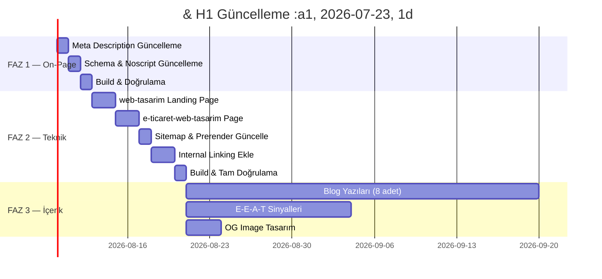

# 🛠️ SEO İyileştirme Uygulama Planı — samer.life

**Hedef Kelimeler:** `e ticaret web tasarım` · `web tasarım` · `websitesi`  
**Strateji:** 3 faz halinde, en yüksek etkili değişikliklerden başlayarak

---

## FAZ 1 — ON-PAGE SEO GÜNCELLEMELERİ (Hemen)

> Bu faz mevcut dosyalardaki metin değişikliklerini kapsar. Yeni sayfa veya component oluşturulmaz.

---

### Adım 1.1: Title Tag Güncelleme

> [!IMPORTANT]
> 3 farklı yerde title tag değiştirilmelidir — hepsi senkron olmalı.

#### [MODIFY] [index.html](file:///c:/Users/ASUS/Downloads/samer-portfolyo-main/samer-portfolyo-main/index.html)
**Satır 11 — Static HTML title:**
```diff
- <title>samer | e-ticaret & web tasarım & yazılım</title>
+ <title>E-Ticaret Web Tasarım & Websitesi Geliştirme Uzmanı | Samer Allaham</title>
```

**Satır 34 — OG title:**
```diff
- <meta property="og:title" content="E-Ticaret Sitesi Kurulumu & Büyüme Uzmanı | Samer Allaham" />
+ <meta property="og:title" content="E-Ticaret Web Tasarım & Websitesi Geliştirme Uzmanı | Samer Allaham" />
```

**Satır 47 — Twitter title:**
```diff
- <meta name="twitter:title" content="E-Ticaret Sitesi Kurulumu & Büyüme Uzmanı | Samer Allaham" />
+ <meta name="twitter:title" content="E-Ticaret Web Tasarım & Websitesi Geliştirme Uzmanı | Samer Allaham" />
```

---

#### [MODIFY] [SEO.jsx](file:///c:/Users/ASUS/Downloads/samer-portfolyo-main/samer-portfolyo-main/src/components/SEO.jsx)
**routeSEOMap `'/'` girişi (Satır 10-16):**
```diff
  '/': {
-   title: 'samer | e-ticaret & web tasarım & yazılım',
+   title: 'E-Ticaret Web Tasarım & Websitesi Geliştirme Uzmanı',
    description:
-     'Shopify ve İKAS ile profesyonel e-ticaret sitesi kuruyorum...',
+     'Profesyonel e-ticaret web tasarım ve websitesi geliştirme hizmetleri. Shopify & İKAS ile yüksek dönüşümlü online mağaza kurulumu. İstanbul merkezli uzman — Samer Allaham.',
    keywords:
-     'shopify kurulumu türkiye, ikas e-ticaret sitesi, e-ticaret sitesi kurulumu, e-ticaret optimizasyon, shopify danışmanlık, samer allaham',
+     'e ticaret web tasarım, web tasarım, websitesi, e-ticaret sitesi kurulumu, shopify kurulumu türkiye, ikas e-ticaret, web tasarım istanbul, profesyonel web tasarım, websitesi yaptırmak',
  },
```

---

#### [MODIFY] [prerender.cjs](file:///c:/Users/ASUS/Downloads/samer-portfolyo-main/samer-portfolyo-main/scripts/prerender.cjs)
**Ana sayfa `''` girişi (Satır 21-26):**
```diff
  '': {
-   title: 'E-Ticaret Sitesi Kurulumu & Büyüme Uzmanı | Samer Allaham',
+   title: 'E-Ticaret Web Tasarım & Websitesi Geliştirme Uzmanı | Samer Allaham',
-   description: 'Shopify ve İKAS ile profesyonel e-ticaret sitesi kuruyorum...',
+   description: 'Profesyonel e-ticaret web tasarım ve websitesi geliştirme hizmetleri. Shopify & İKAS ile yüksek dönüşümlü online mağaza kurulumu. İstanbul merkezli uzman — Samer Allaham.',
-   keywords: 'shopify kurulumu türkiye, ikas e-ticaret sitesi, e-ticaret sitesi kurulumu...',
+   keywords: 'e ticaret web tasarım, web tasarım, websitesi, e-ticaret sitesi kurulumu, shopify kurulumu türkiye, ikas e-ticaret, web tasarım istanbul, profesyonel web tasarım',
```

---

### Adım 1.2: H1 Başlığı Güncelleme

#### [MODIFY] [Home.jsx](file:///c:/Users/ASUS/Downloads/samer-portfolyo-main/samer-portfolyo-main/src/pages/Home.jsx)
**Satır 42 — Ana sayfa H1:**
```diff
  <h1 className="text-5xl sm:text-6xl md:text-7xl xl:text-8xl font-black ...">
-   {i18n.language === 'tr' ? 'E-Ticaret & Yazılım Çözümleri Uzmanı' : ...}
+   {i18n.language === 'tr' ? 'E-Ticaret Web Tasarım & Websitesi Geliştirme Uzmanı' : i18n.language === 'ar' ? 'خبير تصميم مواقع التجارة الإلكترونية' : 'E-Commerce Web Design & Website Development Expert'}
  </h1>
```

---

### Adım 1.3: Meta Description Güncelleme

#### [MODIFY] [index.html](file:///c:/Users/ASUS/Downloads/samer-portfolyo-main/samer-portfolyo-main/index.html)
**Satır 13-14 — Ana description:**
```diff
  <meta name="description"
-   content="Shopify ve İKAS ile profesyonel e-ticaret sitesi kuruyorum. Dönüşüm odaklı optimizasyon, stok otomasyonu ve ürün içerik servisleri. Türkiye'nin e-ticaret büyüme uzmanı Samer Allaham." />
+   content="Profesyonel e-ticaret web tasarım ve websitesi geliştirme hizmetleri. Shopify & İKAS ile yüksek dönüşümlü online mağaza kurulumu. İstanbul merkezli uzman — Samer Allaham." />
```

**Satır 35-36 — OG description:**
```diff
  <meta property="og:description"
-   content="Shopify ve İKAS ile profesyonel e-ticaret sitesi kuruyorum..." />
+   content="Profesyonel e-ticaret web tasarım ve websitesi geliştirme hizmetleri. Shopify & İKAS ile yüksek dönüşümlü online mağaza kurulumu." />
```

---

### Adım 1.4: Noscript Crawlable Content Güncelleme

#### [MODIFY] [index.html](file:///c:/Users/ASUS/Downloads/samer-portfolyo-main/samer-portfolyo-main/index.html)
**Satır 269 — noscript H1:**
```diff
- <h1>E-Ticaret Sitesi Kurulumu & Büyüme Uzmanı | Samer Allaham</h1>
+ <h1>E-Ticaret Web Tasarım & Websitesi Geliştirme Uzmanı | Samer Allaham</h1>
```

**Satır 270-273 — noscript açıklama paragrafı:**
```diff
  <p>
-   Merhaba, ben <strong>Samer Allaham</strong> — Türkiye merkezli e-ticaret büyüme uzmanı.
-   Shopify ve İKAS platformlarında yüksek dönüşüm oranlı e-ticaret sistemleri kuruyorum.
-   Satışlarınızı artıran, süreçlerinizi otomatikleştiren profesyonel ekosistemler inşa ediyorum.
+   Merhaba, ben <strong>Samer Allaham</strong> — İstanbul merkezli profesyonel <strong>e-ticaret web tasarım</strong> ve <strong>websitesi</strong> geliştirme uzmanı.
+   Shopify ve İKAS ile yüksek dönüşümlü online mağaza kurulumu, <strong>web tasarım</strong> ve yazılım çözümleri sunuyorum.
  </p>
```

---

### Adım 1.5: Schema.org JSON-LD Güncelleme

#### [MODIFY] [index.html](file:///c:/Users/ASUS/Downloads/samer-portfolyo-main/samer-portfolyo-main/index.html)
**Satır 71 — WebSite Schema `name`:**
```diff
- "name": "Samer Allaham | E-Ticaret Uzmanı",
+ "name": "Samer Allaham | E-Ticaret Web Tasarım & Websitesi Uzmanı",
```

**Satır 95 — Person Schema `jobTitle`:**
```diff
- "jobTitle": "E-Ticaret Sistemleri ve Büyüme Uzmanı",
+ "jobTitle": "E-Ticaret Web Tasarım & Websitesi Geliştirme Uzmanı",
```

**Satır 136 — ProfessionalService Schema `name`:**
```diff
- "name": "Samer Allaham E-Ticaret Hizmetleri",
+ "name": "Samer Allaham | E-Ticaret Web Tasarım & Websitesi Geliştirme Hizmetleri",
```

---

### Adım 1.6: Hizmetler Sayfası Keywords Güncelleme

#### [MODIFY] [SEO.jsx](file:///c:/Users/ASUS/Downloads/samer-portfolyo-main/samer-portfolyo-main/src/components/SEO.jsx)
**`/hizmetler` girişi (Satır 17-23):**
```diff
  '/hizmetler': {
-   title: 'E-Ticaret Hizmetleri',
+   title: 'Web Tasarım & E-Ticaret Websitesi Hizmetleri',
-   description: 'Shopify kurulumu, İKAS e-ticaret sitesi...',
+   description: 'Profesyonel web tasarım, e-ticaret websitesi kurulumu, dönüşüm optimizasyonu ve stok otomasyon hizmetleri. Shopify & İKAS uzmanı Samer Allaham.',
-   keywords: 'shopify hizmetleri, ikas kurulum...',
+   keywords: 'web tasarım hizmetleri, e ticaret web tasarım, websitesi kurulumu, shopify hizmetleri, ikas kurulum, e-ticaret optimizasyon',
  },
```

---

### ✅ FAZ 1 Doğrulama Adımları

1. `npm run build` ile build alıp hata olmadığını doğrula
2. `dist/index.html` içinde yeni title tag'ını kontrol et
3. Her prerender edilmiş HTML'de (`dist/eticaret-site-kurulumu/index.html` vb.) title ve description'ları doğrula

---

## FAZ 2 — TEKNİK SEO & YENİ SAYFALAR (1-2 Hafta)

> Bu faz yeni landing page'ler, sitemap güncellemeleri ve internal linking altyapısını kapsar.

---

### Adım 2.1: `/web-tasarim` Landing Page Oluşturma

> [!IMPORTANT]
> "web tasarım" anahtar kelimesi için **özel, derin içerikli** bir landing page.

#### [NEW] Route Ekleme — [App.jsx](file:///c:/Users/ASUS/Downloads/samer-portfolyo-main/samer-portfolyo-main/src/App.jsx)
```diff
  {/* === TURKISH ROUTES === */}
+ <Route path="/web-tasarim" element={<ServiceDetail />} />

  {/* === ENGLISH ROUTES === */}
+ <Route path="/en/web-design" element={<ServiceDetail />} />

  {/* === ARABIC ROUTES === */}
+ <Route path="/ar/web-design" element={<ServiceDetail />} />
```

#### [MODIFY] [ServiceDetail.jsx](file:///c:/Users/ASUS/Downloads/samer-portfolyo-main/samer-portfolyo-main/src/pages/ServiceDetail.jsx)
**routeToKeyMap'e ekle:**
```diff
+ '/web-tasarim': 'web-gelistirme',
+ '/en/web-design': 'web-gelistirme',
+ '/ar/web-design': 'web-gelistirme',
```

> [!NOTE]
> Bu sayfa mevcut `web-gelistirme` hizmet verisiyle çalışır ama URL olarak `/web-tasarim` slug'ını kullanır — Google için en önemli sinyal budur.

#### [MODIFY] [SEO.jsx](file:///c:/Users/ASUS/Downloads/samer-portfolyo-main/samer-portfolyo-main/src/components/SEO.jsx)
**routeSEOMap'e yeni giriş:**
```javascript
'/web-tasarim': {
  title: 'Profesyonel Web Tasarım | Modern Websitesi Geliştirme — Samer',
  description: 'React & Next.js ile modern, hızlı ve SEO uyumlu web tasarım hizmetleri. Kurumsal websitesi, portfolyo ve e-ticaret web tasarımı. İstanbul merkezli uzman.',
  keywords: 'web tasarım, web tasarım istanbul, profesyonel web tasarım, websitesi tasarımı, kurumsal web tasarım, modern web tasarım',
},
```

#### [MODIFY] [navigation.js](file:///c:/Users/ASUS/Downloads/samer-portfolyo-main/samer-portfolyo-main/src/utils/navigation.js)
**pageLanguageMap'e ekle:**
```javascript
'/web-tasarim': { tr: '/web-tasarim', en: '/en/web-design', ar: '/ar/web-design' },
'/en/web-design': { tr: '/web-tasarim', en: '/en/web-design', ar: '/ar/web-design' },
'/ar/web-design': { tr: '/web-tasarim', en: '/en/web-design', ar: '/ar/web-design' },
```

---

### Adım 2.2: `/e-ticaret-web-tasarim` Landing Page Oluşturma

> "e ticaret web tasarım" ana hedef kelime için özel sayfa.

#### Aynı pattern ile:

| Dosya | Eklenecek |
|-------|-----------|
| **App.jsx** | `<Route path="/e-ticaret-web-tasarim" element={<ServiceDetail />} />` |
| **ServiceDetail.jsx** | `'/e-ticaret-web-tasarim': 'site-kurulumu'` (mevcut e-ticaret kurulum verisiyle) |
| **SEO.jsx** | Yeni routeSEOMap girişi (title: `E-Ticaret Web Tasarım \| Profesyonel Online Mağaza — Samer`) |
| **navigation.js** | `'/e-ticaret-web-tasarim': { tr: '/e-ticaret-web-tasarim', en: '/en/ecommerce-web-design', ar: '/ar/ecommerce-web-design' }` |
| **prerender.cjs** | Yeni sayfa girişi + hreflang lookup |
| **sitemap.xml** | Yeni `<url>` girişi |

#### SEO.jsx için routeSEOMap:
```javascript
'/e-ticaret-web-tasarim': {
  title: 'E-Ticaret Web Tasarım | Profesyonel Online Mağaza Kurulumu — Samer',
  description: 'E-ticaret web tasarım hizmetleri. Shopify & İKAS ile satış yapan, mobil uyumlu ve SEO dostu online mağaza websitesi tasarımı. Samer Allaham.',
  keywords: 'e ticaret web tasarım, e-ticaret web tasarım, online mağaza tasarımı, e-ticaret websitesi, shopify web tasarım, ikas web tasarım',
},
```

---

### Adım 2.3: Eksik Sayfaları Sitemap'e Ekleme

#### [MODIFY] [sitemap.xml](file:///c:/Users/ASUS/Downloads/samer-portfolyo-main/samer-portfolyo-main/public/sitemap.xml)

Şu sayfalar eklenmeli:
```xml
<!-- WEB TASARIM SAYFASI -->
<url>
  <loc>https://www.samer.life/web-tasarim</loc>
  <lastmod>2026-07-23</lastmod>
  <changefreq>monthly</changefreq>
  <priority>0.95</priority>
</url>

<!-- E-TİCARET WEB TASARIM SAYFASI -->
<url>
  <loc>https://www.samer.life/e-ticaret-web-tasarim</loc>
  <lastmod>2026-07-23</lastmod>
  <changefreq>monthly</changefreq>
  <priority>0.95</priority>
</url>

<!-- WEB SİTESİ GELİŞTİRME (MEVCUT AMA EKSİK) -->
<url>
  <loc>https://www.samer.life/web-sitesi-gelistirme</loc>
  <lastmod>2026-07-23</lastmod>
  <changefreq>monthly</changefreq>
  <priority>0.9</priority>
</url>

<!-- YAPAY ZEKA ÇÖZÜMLERİ (MEVCUT AMA EKSİK) -->
<url>
  <loc>https://www.samer.life/yapay-zeka-cozumleri</loc>
  <lastmod>2026-07-23</lastmod>
  <changefreq>monthly</changefreq>
  <priority>0.85</priority>
</url>

<!-- ÖZEL YAZILIM GELİŞTİRME (MEVCUT AMA EKSİK) -->
<url>
  <loc>https://www.samer.life/ozel-yazilim-gelistirme</loc>
  <lastmod>2026-07-23</lastmod>
  <changefreq>monthly</changefreq>
  <priority>0.85</priority>
</url>

<!-- SSS / FAQ SAYFASI -->
<url>
  <loc>https://www.samer.life/faq</loc>
  <lastmod>2026-07-23</lastmod>
  <changefreq>weekly</changefreq>
  <priority>0.8</priority>
</url>
```

---

### Adım 2.4: Prerender Script'ine Eksik Sayfaları Ekleme

#### [MODIFY] [prerender.cjs](file:///c:/Users/ASUS/Downloads/samer-portfolyo-main/samer-portfolyo-main/scripts/prerender.cjs)

`pages` object'ine şu girişler eklenmeli:

```javascript
'web-tasarim': {
  title: 'Profesyonel Web Tasarım | Modern Websitesi Geliştirme — Samer',
  description: 'React & Next.js ile modern, hızlı ve SEO uyumlu web tasarım hizmetleri. Kurumsal websitesi, portfolyo ve e-ticaret web tasarımı.',
  keywords: 'web tasarım, web tasarım istanbul, profesyonel web tasarım, websitesi tasarımı',
  canonical: 'https://www.samer.life/web-tasarim',
  lang: 'tr',
  content: `<h1>Profesyonel Web Tasarım Hizmetleri | Samer Allaham</h1>
  <p>Modern web tasarım ve websitesi geliştirme hizmetleri. React & Next.js ile SEO uyumlu, hızlı ve mobil dostu kurumsal web tasarım çözümleri.</p>`
},
'e-ticaret-web-tasarim': {
  title: 'E-Ticaret Web Tasarım | Profesyonel Online Mağaza — Samer',
  description: 'E-ticaret web tasarım hizmetleri. Shopify & İKAS ile satış yapan websitesi tasarımı.',
  keywords: 'e ticaret web tasarım, e-ticaret websitesi, online mağaza tasarımı',
  canonical: 'https://www.samer.life/e-ticaret-web-tasarim',
  lang: 'tr',
  content: `<h1>E-Ticaret Web Tasarım | Profesyonel Online Mağaza Kurulumu</h1>
  <p>Shopify ve İKAS ile profesyonel e-ticaret web tasarım ve websitesi geliştirme. Satış odaklı, mobil uyumlu online mağaza kurulumu.</p>`
},
'web-sitesi-gelistirme': {
  title: 'Web Sitesi Geliştirme | React & Next.js — Samer',
  description: 'React ve Next.js ile modern, hızlı ve SEO uyumlu kurumsal web sitesi geliştirme hizmetleri.',
  keywords: 'web sitesi geliştirme, react web sitesi, next.js geliştirme, kurumsal websitesi',
  canonical: 'https://www.samer.life/web-sitesi-gelistirme',
  lang: 'tr',
  content: `<h1>Web Sitesi Geliştirme</h1><p>React ve Next.js ile performans odaklı kurumsal web sitesi geliştirme.</p>`
},
'yapay-zeka-cozumleri': {
  title: 'Yapay Zeka Çözümleri | AI Destekli E-Ticaret — Samer',
  description: 'Yapay zeka ile ürün görseli hazırlama, otomatik içerik üretimi ve chatbot çözümleri.',
  keywords: 'yapay zeka çözümleri, ai e-ticaret, yapay zeka ürün görseli',
  canonical: 'https://www.samer.life/yapay-zeka-cozumleri',
  lang: 'tr',
  content: `<h1>Yapay Zeka Çözümleri</h1><p>E-ticaret operasyonlarınızı AI ile güçlendirin.</p>`
},
```

Ayrıca `lookupMap`'e de eklenmeli:
```javascript
'/web-tasarim': { tr: '/web-tasarim', en: '/en/web-design', ar: '/ar/web-design' },
'/e-ticaret-web-tasarim': { tr: '/e-ticaret-web-tasarim', en: '/en/ecommerce-web-design', ar: '/ar/ecommerce-web-design' },
'/web-sitesi-gelistirme': { tr: '/web-sitesi-gelistirme', en: '/en/web-development', ar: '/ar/web-development' },
'/yapay-zeka-cozumleri': { tr: '/yapay-zeka-cozumleri', en: '/en/ai-solutions', ar: '/ar/ai-solutions' },
```

---

### Adım 2.5: SEO.jsx'e Eksik Sayfaların routeSEOMap ve Schema Eklenmesi

#### [MODIFY] [SEO.jsx](file:///c:/Users/ASUS/Downloads/samer-portfolyo-main/samer-portfolyo-main/src/components/SEO.jsx)

**routeSEOMap'e ekle:**
```javascript
'/web-sitesi-gelistirme': {
  title: 'Web Sitesi Geliştirme | React & Next.js — Samer',
  description: 'React ve Next.js ile modern, hızlı ve SEO uyumlu kurumsal web sitesi geliştirme. Portfolyo, tanıtım ve e-ticaret websitesi tasarımı.',
  keywords: 'web sitesi geliştirme, react web sitesi, next.js web sitesi, kurumsal websitesi, web tasarım',
},
'/yapay-zeka-cozumleri': {
  title: 'Yapay Zeka Çözümleri | AI Destekli E-Ticaret — Samer',
  description: 'E-ticaret mağazanız için yapay zeka destekli ürün görseli, otomatik içerik üretimi ve akıllı chatbot çözümleri.',
  keywords: 'yapay zeka çözümleri, ai e-ticaret, yapay zeka ürün fotoğrafı, chatbot, otomatik içerik',
},
```

**serviceSchemas'a ekle:**
```javascript
'/web-tasarim': {
  name: 'Profesyonel Web Tasarım Hizmeti',
  description: 'React & Next.js ile modern, hızlı, SEO uyumlu web tasarım ve websitesi geliştirme hizmetleri.',
  offers: { price: '30000', priceCurrency: 'TRY', priceSpecification: '30.000 – 65.000 TL' },
},
'/e-ticaret-web-tasarim': {
  name: 'E-Ticaret Web Tasarım Hizmeti',
  description: 'Shopify ve İKAS ile profesyonel e-ticaret web tasarım ve online mağaza kurulumu.',
  offers: { price: '20000', priceCurrency: 'TRY', priceSpecification: '20.000 – 60.000 TL' },
},
'/web-sitesi-gelistirme': {
  name: 'Web Sitesi Geliştirme Hizmeti',
  description: 'React ve Next.js ile kurumsal web sitesi, portfolyo ve tek sayfalık uygulama geliştirme.',
  offers: { price: '30000', priceCurrency: 'TRY', priceSpecification: '30.000 – 65.000 TL' },
},
'/yapay-zeka-cozumleri': {
  name: 'Yapay Zeka E-Ticaret Çözümleri',
  description: 'AI destekli ürün görseli hazırlama, otomatik SEO içerik üretimi ve akıllı chatbot.',
  offers: { price: '5000', priceCurrency: 'TRY', priceSpecification: '5.000 – 25.000 TL' },
},
```

**serviceFAQs'a ekle** (aynı dosyada):
```javascript
'/web-tasarim': [
  { q: 'Web tasarım ve web geliştirme arasındaki fark nedir?', a: 'Web tasarım sitenin görsel ve kullanıcı deneyimi tarafıdır; web geliştirme ise kodlama ve teknik altyapıdır. Biz her iki alanı da kapsar.' },
  { q: 'Web tasarım süreci ne kadar sürer?', a: 'Standart bir kurumsal web tasarım projesi 2-3 haftada tamamlanır. Özel fonksiyonlar gerektiren projeler 4-6 hafta sürebilir.' },
  { q: 'Mobil uyumlu (responsive) web tasarım yapıyor musunuz?', a: 'Evet, tüm projelerimiz mobile-first yaklaşımıyla geliştiriliyor ve her ekran boyutunda mükemmel çalışıyor.' },
],
'/e-ticaret-web-tasarim': [
  { q: 'E-ticaret web tasarım ile normal web tasarım farkı nedir?', a: 'E-ticaret web tasarım, sepet sistemi, ödeme altyapısı, ürün katalog yönetimi ve stok takibi gibi satış odaklı özellikler içerir.' },
  { q: 'Hangi e-ticaret platformunda web tasarım yapıyorsunuz?', a: 'Shopify ve İKAS altyapılarında profesyonel e-ticaret web tasarım hizmeti sunuyoruz.' },
  { q: 'E-ticaret websitesi tasarımı ne kadar tutar?', a: 'E-ticaret web tasarım projelerimiz 20.000 – 60.000 TL arasında değişmektedir.' },
],
```

---

### Adım 2.6: Internal Linking — "İlgili Hizmetler" Bölümü

#### [MODIFY] [ServiceDetail.jsx](file:///c:/Users/ASUS/Downloads/samer-portfolyo-main/samer-portfolyo-main/src/pages/ServiceDetail.jsx)

FAQ bölümünün altına **"İlgili Hizmetler"** grid'i ekle:

```jsx
{/* İlgili Hizmetler — Internal Linking */}
<div className="border-t border-white/5 pt-20">
  <h2 className="text-2xl md:text-3xl font-black text-white tracking-tight mb-8">
    {i18n.language === 'tr' ? 'İlgili Hizmetler' : 'Related Services'}
  </h2>
  <div className="grid grid-cols-1 md:grid-cols-3 gap-6">
    {servicesKeys
      .filter(k => k !== serviceKey)
      .slice(0, 3)
      .map(key => (
        <ServiceCard
          key={key}
          serviceKey={key}
          serviceData={t(`services.items.${key}`, { returnObjects: true })}
        />
      ))}
  </div>
</div>
```

---

### Adım 2.7: Footer'a Yeni Sayfa Linkleri Ekleme

#### [MODIFY] [Footer.jsx](file:///c:/Users/ASUS/Downloads/samer-portfolyo-main/samer-portfolyo-main/src/components/Footer.jsx)

ÇÖZÜMLER bölümüne ekle:
```jsx
<li><Link to={getLocalizedPath('/web-tasarim', i18n.language)} className="...">Web Tasarım</Link></li>
<li><Link to={getLocalizedPath('/e-ticaret-web-tasarim', i18n.language)} className="...">E-Ticaret Web Tasarım</Link></li>
```

---

### ✅ FAZ 2 Doğrulama Adımları

1. `npm run build` — tüm yeni rotaların prerender edildiğini doğrula
2. `dist/web-tasarim/index.html` dosyasının oluşturulduğunu kontrol et
3. `dist/e-ticaret-web-tasarim/index.html` dosyasının oluşturulduğunu kontrol et
4. `dist/sitemap.xml` içinde yeni URL'lerin olduğunu doğrula
5. Tarayıcıda `/web-tasarim` → doğru title ve H1 gösterdiğini kontrol et
6. Rich Results Test ile yeni sayfaların schema'larını doğrula

---

## FAZ 3 — İÇERİK & OTORİTE İNŞASI (Uzun Vade)

> Bu faz kod değişikliği gerektirmez — içerik stratejisi ve dış çalışmalar gerektirir.

---

### Adım 3.1: Blog İçerik Stratejisi

Blog cron'unu (`/api/blog/generate`) şu konularda içerik üretmeye yönlendirin:

| # | Blog Başlığı | Hedef Kelime |
|---|-------------|-------------|
| 1 | "E-Ticaret Web Tasarım: 2026'da Dikkat Edilecek 10 Kural" | `e ticaret web tasarım` |
| 2 | "Web Tasarım Trendleri 2026: Satış Yapan Site Nasıl Olmalı?" | `web tasarım` |
| 3 | "Websitesi Yaptırmak İstiyorum: Başlangıç Rehberi" | `websitesi` |
| 4 | "Web Tasarım Fiyatları 2026: Nelere Dikkat Etmeli?" | `web tasarım` |
| 5 | "E-Ticaret Websitesi Maliyeti: Shopify vs İKAS Karşılaştırması" | `e ticaret websitesi` |
| 6 | "Kurumsal Web Tasarım ile E-Ticaret Web Tasarım Farkları" | `web tasarım` |
| 7 | "Websitesi Hızı Neden Önemli? SEO Etkisi" | `websitesi` |
| 8 | "Web Tasarım ve SEO: Ayrılmaz İkili" | `web tasarım` |

Her blog yazısının sonunda ilgili hizmet sayfasına (`/web-tasarim`, `/e-ticaret-web-tasarim`) CTA link eklenmelidir.

---

### Adım 3.2: E-E-A-T Güven Sinyalleri

| Aksiyon | Detay |
|---------|-------|
| Shopify Partner Badge | Ana sayfaya ve Footer'a Shopify Partner logosu ekle |
| Müşteri Logoları | Çalıştığınız markaların logoları (izinli) → bir "Güvenilen Markalar" bölümü |
| Google Business Profile | Footer'daki Maps linkini daha belirgin yap, review'ları embed et |
| AuthorBox kullanımı | Blog yazılarında AuthorBox bileşenini aktif et |

---

### Adım 3.3: OG Image Oluşturma

Mevcut OG image `avatar.jpeg` (12KB, kare). Google ve sosyal medya için:
- **1200x630** boyutunda profesyonel OG image oluştur
- İçinde: "E-Ticaret Web Tasarım & Websitesi Geliştirme" yazısı + logo

---

## 📊 Uygulama Takvimi Özeti



---

## 📁 Değişecek Dosyaların Tam Listesi

| Dosya | FAZ | Değişiklik Türü |
|-------|-----|----------------|
| [index.html](file:///c:/Users/ASUS/Downloads/samer-portfolyo-main/samer-portfolyo-main/index.html) | 1 | Title, description, OG, schema, noscript güncelleme |
| [SEO.jsx](file:///c:/Users/ASUS/Downloads/samer-portfolyo-main/samer-portfolyo-main/src/components/SEO.jsx) | 1+2 | routeSEOMap, serviceSchemas, serviceFAQs ekleme |
| [Home.jsx](file:///c:/Users/ASUS/Downloads/samer-portfolyo-main/samer-portfolyo-main/src/pages/Home.jsx) | 1 | H1 başlığı güncelleme |
| [prerender.cjs](file:///c:/Users/ASUS/Downloads/samer-portfolyo-main/samer-portfolyo-main/scripts/prerender.cjs) | 1+2 | Ana sayfa title/desc + yeni sayfalar + lookupMap |
| [App.jsx](file:///c:/Users/ASUS/Downloads/samer-portfolyo-main/samer-portfolyo-main/src/App.jsx) | 2 | Yeni Route'lar ekleme |
| [ServiceDetail.jsx](file:///c:/Users/ASUS/Downloads/samer-portfolyo-main/samer-portfolyo-main/src/pages/ServiceDetail.jsx) | 2 | routeToKeyMap + İlgili Hizmetler bölümü |
| [navigation.js](file:///c:/Users/ASUS/Downloads/samer-portfolyo-main/samer-portfolyo-main/src/utils/navigation.js) | 2 | pageLanguageMap yeni girişler |
| [Footer.jsx](file:///c:/Users/ASUS/Downloads/samer-portfolyo-main/samer-portfolyo-main/src/components/Footer.jsx) | 2 | Yeni sayfa linkleri |
| [sitemap.xml](file:///c:/Users/ASUS/Downloads/samer-portfolyo-main/samer-portfolyo-main/public/sitemap.xml) | 2 | 6 yeni URL girişi |

---

> [!CAUTION]
> **Onay sonrası sırayla FAZ 1'den başlayarak uygulayacağım.** Her faz sonunda build alıp doğrulama yapılacak. Onayınızı bekliyorum.
